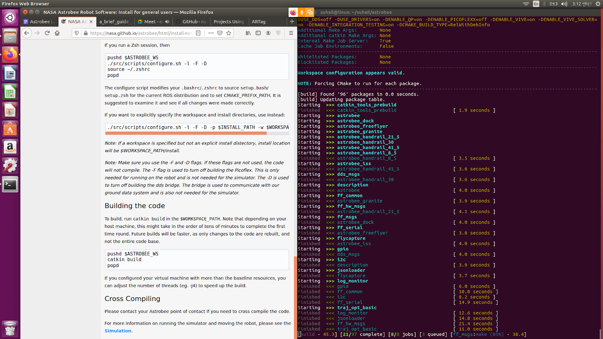
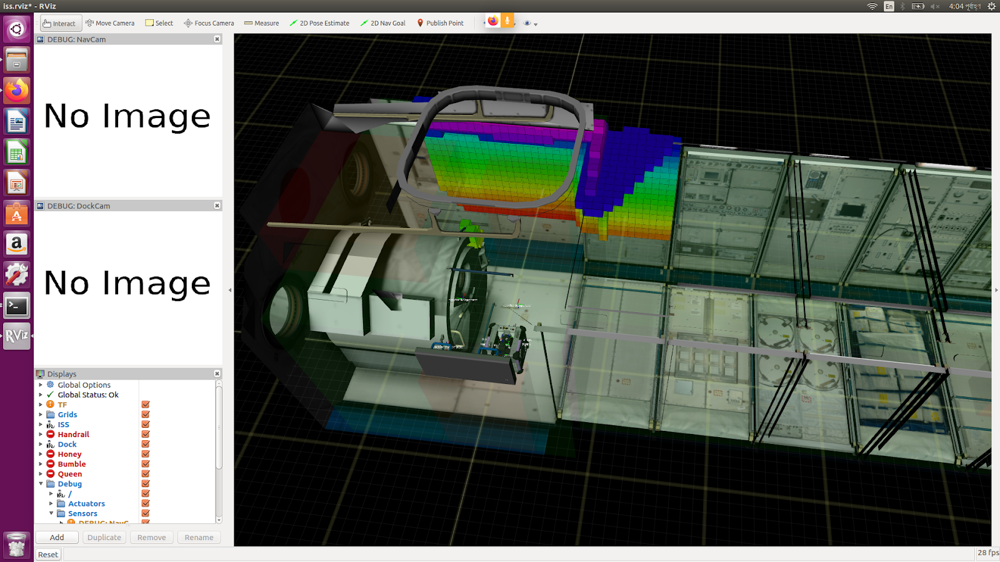

<p align="center"></p> 

# <p align="center"> 3rd KIBO RPC Native Simulator Installation</p>
<p align="center">By Suhail Haque Rafi || Team: Now In Orbit || 3rd KIBO Robot Programming Challenge 2022 || Dhaka, Bangladesh</p>

Three NASA Astrobee free-flying robots have been operating inside the International Space Station (ISS) since 2019. This repository contains installation guide for the Astrobee Robot Software Simulator and supporting tools, primarily written in C++.

Astrobee's flight software performs vision-based localization, provides autonomous navigation, docking and perching, manages various sensors and actuators, and supports human-robot interaction with co-located astronauts via screen-based displays, light signalling, and sound. The flight software is hosted on each Astrobee's three internal single board computers and uses the open-source Robot Operating System (ROS) framework as message-passing middleware. It provides a high-level Astrobee Command API for controlling the robot and has multiple operating modes. It can execute a plan (command sequence), individual operator commands (teleoperation), or commands from guest science code running onboard Astrobee.

The Astrobee Robot Software Simulator, built using ROS and Gazebo, enables the flight software to be evaluated without the need for robot hardware. The supporting tools include a tool that processes ISS imagery to build maps for Astrobee localization, along with many others.


## Download & Install Ubuntu 16.04 LTS 64-Bit on the Computer
Google Drive Link: https://drive.google.com/file/d/1-6uhMWlO_6Bb7fJVnBLacLDj2lsBZNyp/view?usp=sharing

*It is very important to install the 64-bit version of Ubuntu 16.04 LTS. Otherwise the Astrobee Robot Software will not run.*

### Install The Build Essentials
```sh
sudo apt-get install build-essential git
```

This is to make sure that the build code can be checked out. 

*4 GB of RAM is required to compile the software, 8 GB is recommended. If 4 GB isn’t available, then swap space can be used.*

*Ubuntu 16.04 is officially supported by NASA. These instructions are also valid for Ubuntu 18.04 and 20.04, but are not backed up by NASA.*
________________________________________________________

## Machine Setup
### Go to the home directory
```sh
cd ~
```

### Clone the flight software repository
```sh
git clone https://github.com/nasa/astrobee.git
```
*To work with Guest Science Code, the astrobee_android repository is also required. The repository should be used as a submodule*

### Get into the directory
```sh
cd astrobee
```
### Remove the existing android folder
```sh
sudo rm -rf android
```
### Clone the astrobee_android repository
```sh
git clone https://github.com/nasa/astrobee_android.git
```
### Rename the folder to android
```sh
mv astrobee_android android
```
________________________________________________________


## Dependencies

### Update the system
```sh
sudo apt-get update
sudo apt-get upgrade
```
*Root access is required to install the following dependencies.*

### Go to the Astrobee Source Scripts  Setup
```sh
cd scripts/setup
```
### Add the ROS Repository
```sh
./add_ros_repository.sh
```
### Update the system
```sh
sudo apt-get update
```

### Go to debians folder
```sh
cd debians
```
### Install debian build files
```sh
./build_install_debians.sh
```
### Change directory to the previous one
```sh
cd ..
```
### Install desktop packages
```sh
./install_desktop_packages.sh
```


<p align="center">Figure 1: Installing ROS Desktop Packages</p>
                                                      

### Initialize ROS dependencies
```sh
sudo rosdep init
```
### Update ROS Dependencies
```sh
rosdep update
```
**ome error messages will pop up saying that certain libraries can not be found. Those are for the NASA internal use only and are not required by public users provided that software is launched with DDS Disabled.*
```sh
E: Unable to locate package libroyale1
E: Unable to locate package rti
E: Unable to locate package libmiro0
E: Unable to locate package libsoracore1
E: Unable to locate package libroyale-dev
E: Unable to locate package rti-dev
E: Unable to locate package libsoracore-dev
E: Unable to locate package libmiro-dev
```
________________________________________________________


# Configuring The Build Setup

*By default, the configure script uses the following install paths:*
```sh
native build path: astrobee/build
native install path: astrobee/install
```
________________________________________________________

# Configuring The Native Build

*The configure script prepares the build directory for compiling the code. configure.sh is simply a wrapper around CMake that provides an easy way of turning on and off options.*
*To see which options are supported, simply run* ``` configure.sh -h```

### Go to the workspace
```sh
cd astrobee
```
### Run the Configuration Script
```sh
./src/scripts/configure.sh -l -F -D 
```
### Source it to the bashrc file
```sh
source ~/.bashrc
```
*The configure script modifies the* ```.bashrc``` *to* ``` source setup.bash``` *for the current ROS distribution and to set* ``` CMAKE_PREFIX_PATH``` 

*It is suggested to examine it and see if all changes were made correctly.*

*Make sure to use the* ``` -F``` *and* ``` -D ``` *flags. If these flags are not used, the code will not compile.*

*The* ``` -F ``` *flag is used to turn off building the Picoflex. This is only needed for running on the robot and is not needed for the simulator.*

*The* ``` -D ``` *is used to turn off building the* ``` dds bridge ```*. The bridge is used to communicate with our ground data system and is also not needed for the simulator.*
________________________________________________________

## Building The Code

*Depending on the host machine, the build might take a while to complete the first time around.*

*Future builds will be faster, as only changes to the code are rebuilt, and not the entire code base.*

### Go to the project directory
```sh
cd astrobee
```
### Build the code
```sh
catkin build
```


<p align="center">Figure 2: Building The Code</p>


*The number of threads can be adjusted (eg.* ``` -j4 ``` *) to speed up the build.*
________________________________________________________


## Setting Up The Software Environment


*Environment Setup is required so that ROS knows about the new packages provided by Astrobee flight software.*

### Go to development folder
```sh
cd devel 
```
### Add the setup file to bashrc
```sh
source setup.bash
```
________________________________________________________


## Running The Simulator

### Go to development folder
```sh
cd devel 
```
### Add the setup file to bashrc
```sh
source setup.bash
```
*After this command has been completed, ROS commands will run from any directory in the Linux filesystem.*


### Start a simulation of a single Astrobee docked in the ISS
```sh
roslaunch astrobee sim.launch dds:=false robot:=sim_pub rviz:=true
```
*It could take a long time when Gazebo starts for the very first time because it loads some large models.*


<p align="center">Figure 3: Running The Astrobee Native Simulator</p>


*To run the simulation with the Gazebo rendering, add the flag* ``` sviz:=true ```*. This allows one to see the ISS module used for the simulation. However, this is resource-intensive.*

*This command tells ROS to look for the* ``` sim.launch ``` *file provided by the astrobee package, and use* ``` roslaunch ``` *to run it. Internally, ROS maintains a cache of information about package locations, libraries and executables. If the above command doesn't work, try rebuilding the cache.*

### Rebuild the cache
```sh
rospack profile
```
*This command launches both the world and Astrobee. There are things in the world that need to be started up before Astrobee is started up.*
________________________________________________________


*Reference: https://nasa.github.io/astrobee/html/index.html*
